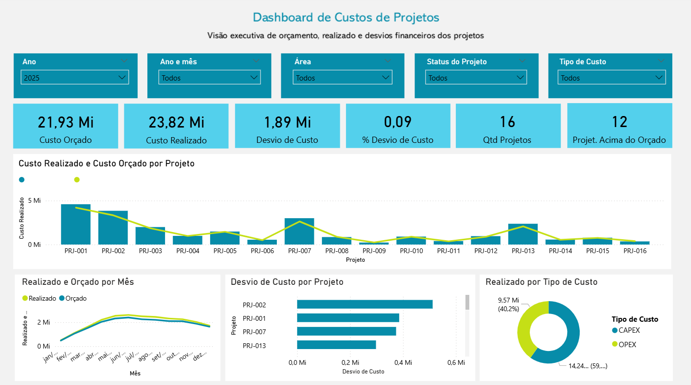

# Dashboard de Custos de Projetos

Este projeto apresenta um dashboard desenvolvido em **Power BI** para monitoramento financeiro de um portfólio de projetos, permitindo acompanhar orçamento, valores realizados e desvios de custo.

O objetivo é fornecer uma **visão executiva clara do desempenho financeiro dos projetos**, facilitando a identificação de desvios e apoiando a tomada de decisão gerencial.

---

## Dashboard

---

## Estrutura do Dashboard

O painel foi estruturado para apresentar uma visão executiva do portfólio de projetos, contemplando:

### Indicadores principais
- Custo Orçado
- Custo Realizado
- Desvio de Custo
- % de Desvio de Custo
- Quantidade de Projetos
- Projetos Acima do Orçamento

### Análises visuais
- **Custo Realizado vs Custo Orçado por Projeto**
- **Realizado vs Orçado ao longo do tempo**
- **Desvio de Custo por Projeto**
- **Distribuição de custos por tipo (CAPEX e OPEX)**

### Filtros disponíveis
- Ano
- Ano e Mês
- Área
- Status do Projeto
- Tipo de Custo

Esses filtros permitem analisar o desempenho financeiro dos projetos sob diferentes perspectivas.

---

## Ferramentas Utilizadas

- **Power BI**
- **DAX (Data Analysis Expressions)**
- **Modelagem de Dados**
- **Design de Dashboard**

---

## Objetivo do Projeto

Demonstrar a aplicação de **análise de dados e visualização em Power BI** para acompanhamento financeiro de projetos, com foco em:

- Monitoramento de orçamento e custos realizados
- Identificação de desvios financeiros
- Análise do portfólio de projetos
- Apoio à tomada de decisão executiva

---

## ⚠️ Observação

Este projeto utiliza **dados fictícios**, criados apenas para fins de estudo e demonstração de habilidades em **Business Intelligence e análise de dados**.

---

## Autora

**Gabriela Cerqueira**
